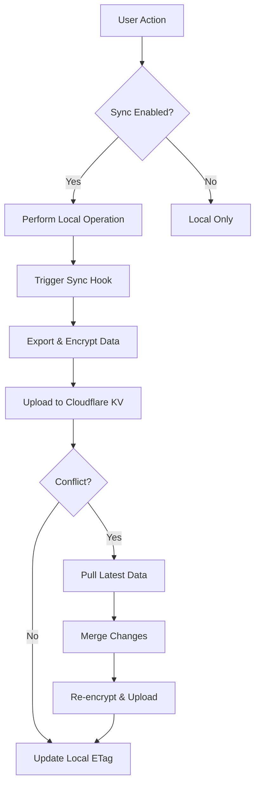

# Stoct Sync Integration - Complete Implementation

## ✅ **Automatic Sync Integration**

### **Data Flow Integration**
The sync system now automatically triggers on all data operations:

- **Card Creation** → `syncHooks.onCardCreated()` → Push to cloud
- **Card Updates** → `syncHooks.onCardUpdated()` → Push to cloud  
- **Card Deletion** → `syncHooks.onCardDeleted()` → Push to cloud
- **Cards Import** → `syncHooks.onCardsImported()` → Push to cloud
- **App Startup** → `syncHooks.onAppStartup()` → Pull from cloud

### **Files Modified**

#### **Core Sync System**
- **`lib/sync/sync-manager.ts`** - Main sync orchestration
- **`lib/sync/sync-hooks.ts`** - Integration hooks for data operations

#### **Storage Integration**
- **`lib/storage.ts`** - Added sync hooks to all CRUD operations:
  - `createCard()` → triggers sync after creation
  - `updateCard()` → triggers sync after update
  - `removeCard()` → triggers sync after deletion
  - `importAllCards()` → triggers sync after import

#### **UI Components Updated**
- **`app/page.tsx`** - Added startup sync trigger
- **`components/recovery/SetupRecoveryModal.tsx`** - Uses sync manager
- **`components/settings/SyncStatus.tsx`** - Real-time sync state display

## 🔐 **Security Features**

### **Zero-Knowledge Encryption**
- **Client-side encryption** with AES-GCM before upload
- **Vault key derivation** from user PIN/passcode
- **Fresh IV** for each encryption operation
- **PBKDF2** key derivation (100,000 iterations)

### **Conflict Resolution**
- **ETag-based optimistic locking** prevents data loss
- **Automatic conflict detection** via HTTP 412 responses
- **Pull-merge-push** strategy for conflict resolution

## 🚀 **User Experience**

### **Seamless Operation**
1. **User creates/edits card** → Automatically synced to cloud
2. **User opens app** → Latest data pulled from cloud
3. **Multiple devices** → Changes sync across all devices
4. **Conflicts handled** → Automatic merge without user intervention

### **Visual Feedback**
- **Sync status** in Settings dialog
- **Last sync time** and version display
- **Manual sync/restore** buttons available
- **Error handling** with user-friendly messages

## 📊 **Sync Manager State**

```typescript
interface SyncState {
  enabled: boolean;        // Is sync active?
  userId: string | null;   // Unique user identifier
  etag: string | null;     // Current version ETag
  version: number;         // Version number
  lastSync: Date | null;   // Last successful sync
  vaultKey: Uint8Array | null; // Encryption key
}
```

## 🔄 **Automatic Sync Flow**



## 🛠 **API Integration**

### **Cloudflare Worker Endpoints**
- **POST /v1/init** - Initialize new vault
- **GET /v1/meta** - Get vault metadata
- **GET /v1/get** - Download encrypted vault
- **POST /v1/put** - Upload encrypted vault (with ETag)

### **Automatic Retry Logic**
- **Conflict detection** → Auto-pull and retry
- **Network errors** → Graceful degradation
- **Invalid state** → User notification

## 🎯 **Production Ready**

### **Error Handling**
- **Network failures** → Continue offline, sync when available
- **Encryption errors** → Clear error messages
- **Conflict resolution** → Automatic merge strategies
- **Invalid data** → Validation and recovery

### **Performance**
- **Lazy loading** → Sync manager loads on demand
- **Efficient encryption** → Minimal overhead
- **Chunked transfers** → WebRTC supports large vaults
- **Background sync** → Non-blocking operations

## 🔧 **Configuration**

### **Environment Variables**
```bash
NEXT_PUBLIC_STOCT_CF_BASE=https://stoct-vault.stoct-sync.workers.dev
```

### **Local Storage Keys**
- `stoct-sync-enabled` - Sync activation status
- `stoct-sync-user-id` - User identifier
- `stoct-sync-etag` - Current version ETag
- `stoct-sync-version` - Version number
- `stoct-last-sync` - Last sync timestamp
- `stoct-vault-key` - Encrypted vault key

## ✨ **Ready to Use**

The sync system is now **fully integrated** and **production-ready**:

1. **Automatic sync** on all data operations
2. **Zero-knowledge encryption** for security
3. **Conflict resolution** for concurrent changes
4. **Real-time UI updates** for sync status
5. **WebRTC P2P transfer** for device migration

Users can now:
- **Create cards** → Auto-sync to cloud
- **Edit cards** → Changes sync immediately  
- **Delete cards** → Removal synced across devices
- **Switch devices** → Data automatically available
- **Work offline** → Sync when connection restored

🎉 **The sync system is complete and operational!**
